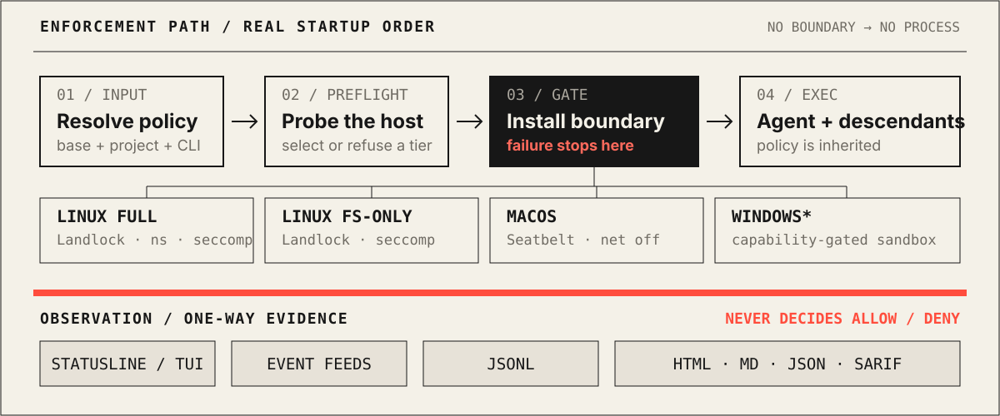
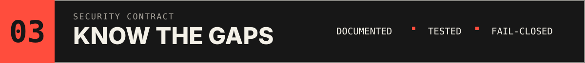

<p align="center">
  
</p>

<p align="center">
  <a href="https://github.com/shleder/vetto/actions/workflows/ci.yml"></a>
  <a href="https://www.npmjs.com/package/vetto"></a>
</p>

<p align="center">
  <a href="#run-it">Run it</a> ·
  <a href="#boundary">Boundary</a> ·
  <a href="#controls">Controls</a> ·
  <a href="#platforms">Platforms</a> ·
  <a href="#configuration">Configuration</a> ·
  <a href="#limits">Limits</a> ·
  <a href="SECURITY.md">Security</a>
</p>

`vetto` launches Codex, Claude Code, Aider, custom scripts, and other local
commands inside an operator-controlled OS security boundary. It applies the
policy before `exec`, makes descendants inherit it, filters the child
environment, defaults the network to off, and leaves session evidence without
turning observation into enforcement.

> [!IMPORTANT]
> **No boundary, no process.** If the selected sandbox cannot be established,
> vetto refuses to launch the agent. It never falls back to an ordinary
> unsandboxed command.

### A real capability probe

This is an excerpt from `vetto doctor` on the project's current GitHub
Codespace. Your host is probed at runtime; the tier is never assumed.

```console
$ vetto doctor
vetto v0.1.0 doctor
landlock:                available (ABI 4)
unprivileged userns:     yes
full namespace stack:    yes
seccomp filters:         yes
seccomp user-notify:     yes
audit feed readable:     no
chosen tier:             full
```

The last two lines are deliberate: enforcement can be fully active even when
the host does not expose a readable audit feed.

<a id="boundary"></a>

<p align="center">
  
</p>

The startup order is the security property: policy resolution and capability
checks happen before the agent exists. The TUI, event readers, JSONL stream,
and reports sit below a one-way boundary; none of them can grant an operation.

<a id="run-it"></a>

<p align="center">
  
</p>

## Run it

Install the stable package from npm, inspect the machine, then add `vetto --`
before the command you already use:

```console
npm install --global vetto
vetto doctor
cd my-project
vetto --agent codex --profile default -- codex exec "review auth"
```

The npm package includes native executables for Linux x64/ARM64, macOS
x64/Apple Silicon, and Windows x64. It selects the matching executable locally;
there is no install-time binary downloader. To install this release exactly,
use `npm install --global vetto@0.1.0`.

<details>
<summary><strong>Build directly from source</strong></summary>

```console
cargo install --locked --git https://github.com/shleder/vetto
```

</details>

The wrapper accepts any executable:

```console
vetto -- claude -p "fix the failing test"
vetto -- aider
vetto -- opencode
vetto -- python agent.py
```

For an interactive agent, the default `--tui=statusline` preserves the
agent's PTY and reserves one row for vetto. Use `--tui=full` for the dashboard
or `--tui=none` for scripts and CI. `vetto init` creates a starter
`vetto.toml` in the current project.

## Why an outer boundary?

Agent-built sandboxes are useful defense in depth, but their policies,
platform coverage, defaults, and reporting differ. vetto gives the operator
one outer policy without detecting, disabling, or weakening the sandbox
inside the agent.

| Competitor / alternative | Overlap | What vetto adds |
| --- | --- | --- |
| AgentJail | High | Daemon-less core path; no OPA/Rego service |
| Watchfire | High | No persistent `watchfired` service |
| ZeroClaw | Medium | Terminal-native operation and post-session artifacts; no web dashboard |
| landrun | Medium | Agent presets, TUI, reports, and a macOS backend |
| **Agent built-in sandboxes (Codex, Claude Code, etc.)** | High | One operator-controlled policy and report model across agents; a consistent outer layer for custom, optional, older, or absent built-ins |

<a id="controls"></a>

## What the boundary controls

| Surface | Enforcement | Operator-facing control |
| --- | --- | --- |
| Filesystem and secrets | Landlock on Linux and Seatbelt on macOS; Windows refuses policies whose requested path exclusions cannot be represented | Additive read/write roots; resolved secret masking in Linux FULL; fail-closed bounded enumeration in FS-ONLY |
| Processes and kernel interfaces | Namespace/process containment plus inherited seccomp on Linux; Job Object/restricted token on Windows | Linux seccomp blocks `umount2`, `ptrace`, `process_vm_*`, `pidfd_getfd`, `io_uring`, `userfaultfd`, `bpf`, and `perf_event_open`; resource limits are backend-specific |
| Network | Off by default; Linux FULL can use a host-side relay | Domain allowlist, exact domain+port rules, and an explicit Git-over-SSH helper |
| Environment | Child environment rebuilt from an allowlist | Explicit `[environment].pass_through`; token, cloud, and API-key variables are stripped by default |
| Session evidence | PTY/TUI, optional event feeds, JSONL, HTML, Markdown, JSON, SARIF | `--observe-seccomp`, `--fail-on-block`, `--report-dir`, and bounded retention; evidence never changes allow/deny |

### Network modes

```console
# No external network. This is the default.
vetto --net=off -- agent command

# Linux FULL: proxy-aware traffic to listed domains.
vetto --net=allowlist:api.github.com,registry.npmjs.org -- agent command

# Linux FULL: exact host and port.
vetto --net=strict:registry.npmjs.org:443 -- agent command

# Linux FULL: explicit SSH relay; the host/port must also be allowed.
vetto --net=strict:github.com:22 --git-ssh -- git fetch origin
```

The broker resolves DNS outside the sandbox, rejects loopback, private,
link-local, metadata, and other special-use destinations, pins the approved
IP for the connection, and pumps opaque bytes. There is no SNI parsing, TLS
decryption, CA injection, or TLS MITM. Non-proxy protocols have no route
unless an explicit helper exists. See [docs/network.md](docs/network.md).

### Reports and CI

```console
vetto --ci --tui=none --profile=strict --net=off \
  --report=json,sarif --report-dir=.vetto/reports \
  --fail-on-block -- agent command
```

Reports use private, collision-resistant names and bounded retention. The
sanitizer is explicitly best-effort: false positives and false negatives are
possible, and reports contain observed events rather than proof of complete
denial visibility.

<a id="platforms"></a>

<p align="center">
  
</p>

## Platform matrix

| Platform | Enforcement path | Current scope | Honest boundary |
| --- | --- | --- | --- |
| **Linux FULL** | Landlock + USER/MOUNT/PID/NET/IPC namespaces + seccomp | Filesystem masking, descendant containment, network-off, allowlist/strict relay, Git SSH helper | Preferred tier; requires the complete unprivileged namespace setup |
| **Linux FS-ONLY** | Landlock + seccomp, without namespaces | Filesystem policy, environment filtering, process hardening, network-off | No mount/PID/network namespace; relay modes are refused |
| **macOS** | Seatbelt through `/usr/bin/sandbox-exec` | Filesystem policy and network-off spawn path | `sandbox-exec` is deprecated and undocumented; FSEvents is change-only |
| **Windows** | Windows 11 experimental process sandbox/AppContainer + restricted low-integrity token + Job Object | Capability-gated network-off process launch with inherited stdio | Conditional backend, not a Linux-equivalent fallback; missing APIs stop launch |

The core path does not self-elevate. Linux needs no root when the host permits
the required unprivileged setup. Optional Windows WFP, ETW, Event Log,
minifilter, or Windows Sandbox integrations remain capability/privilege gated
and are never silently enabled. Details:
[docs/platform-backends.md](docs/platform-backends.md).

### Linux tier difference

| | FULL | FS-ONLY |
| --- | --- | --- |
| Secret handling | File-bind and empty-tmpfs overlays before Landlock | Bounded project enumeration; errors instead of widening access when it cannot complete |
| Descendants | PID-namespace supervisor contains and reaps them | Private process group + `PR_SET_PDEATHSIG`; a `setsid()` grandchild can outlive cleanup |
| Network | Off, allowlist, strict, Git SSH relay | Off only |
| Compatibility | Requires usable unprivileged namespaces and private `/proc` | Smaller boundary with fewer host requirements |

<a id="configuration"></a>

## Profiles and policy

Named agent presets add narrowly scoped compatibility reads; they never turn
off the base policy. Available presets include `codex`, `claude`, `aider`,
`cursor`, `cline`, `opencode`, `copilot`, and `custom`.

| Profile | Read/write posture | Use when |
| --- | --- | --- |
| `default` | Project and temp writes; common system/toolchain/cache reads | Normal local development |
| `strict` | Project writes; minimal system/runtime reads | Reduce ambient access |
| `audit` | Same filesystem posture as `default` | Pair with event feeds and reports |
| `permissive` | Wider system/toolchain reads; secrets remain denied | Compatibility troubleshooting |

```console
vetto profiles
vetto --profile strict -- codex exec "review this change"
vetto --profile audit --observe-seccomp --jsonl session.jsonl \
  --report html,md,json -- codex exec "review this change"
```

<details>
<summary><strong>Minimal vetto.toml</strong></summary>

```toml
[metadata]
name = "my-project"
extends = "default"

[filesystem]
allow_write = ["$PROJECT", "/tmp"]
allow_read = ["$HOME/.cargo/registry"]

[display_only_deny]
paths = ["$PROJECT/.env", "$HOME/.ssh"]

[environment]
pass_through = ["EDITOR", "GIT_AUTHOR_NAME"]

[conditions]
branch = ["main"]
file_exists = ["package.json"]
```

</details>

Project policy is loaded only from a non-symlink `vetto.toml`; `--policy`
adds another layer. Unknown tables and fields are errors. Network, reporting,
and CI remain CLI settings: `[network]`, `[project]`, `[secrets]`,
`[agent_overrides]`, and `[ci]` are not accepted policy tables. See
[docs/profiles.md](docs/profiles.md).

### Isolated multi-agent sessions

Each manifest entry receives its own policy resolution, backend, process
container, event stream, output buffer, and report directory. Commands are
argv arrays rather than shell strings.

<details>
<summary><strong>Multi-agent manifest</strong></summary>

```toml
version = 1
report_dir = ".vetto-reports"

[[agents]]
name = "lint"
command = ["cargo", "clippy", "--all-targets"]
profile = "strict"
net = "off"

[[agents]]
name = "review"
command = ["codex", "exec", "review this change"]
profile = "default"
net = "off"
observe_seccomp = true
```

```console
vetto multi --manifest vetto-agents.toml
```

</details>

The split-pane runtime currently launches on Unix. Windows fails closed
instead of silently running an uncontained multi-agent session.

### GitHub Actions

```yaml
permissions:
  contents: read
  security-events: write

steps:
  - uses: actions/checkout@v4
  - uses: shleder/vetto/action@main
    with:
      command: codex exec "review this PR"
      profile: strict
      net: off
      report: json,sarif
      upload-sarif: "true"
```

The action builds the checked-out source with `--locked`; it does not download
or publish a release. Do not interpolate untrusted pull-request text into its
shell command. See [docs/ci-cd.md](docs/ci-cd.md).

<a id="limits"></a>

<p align="center">
  
</p>

## What vetto does not promise

- Observation is not complete auditing. Linux deny feeds may be unavailable
  without usable seccomp user-notify or audit privileges; enforcement remains
  active.
- Linux FS-ONLY cannot contain a `setsid()`-detached grandchild as strongly as
  the FULL PID namespace.
- macOS FSEvents does not reveal file reads or Seatbelt denials, and a
  SIGKILLed vetto can leave process-group orphans.
- Linux allowlist traffic is designed for proxy-shaped protocols. Direct
  non-proxy protocols fail closed unless an explicit relay helper exists.
- Windows is capability-gated and experimental. It currently has no domain
  allowlist relay or multi-agent runtime in the core backend.
- A hostile kernel, root/administrator outside the sandbox, physical access,
  and a compromised vetto binary are out of scope.
- No performance percentage is promised. Measurement rules live in
  [docs/performance.md](docs/performance.md).

### Deliberate anti-features

No persistent daemon. No OPA/Rego engine. No cloud or telemetry. No web
dashboard. No TLS MITM or CA injection. No root fallback. No Docker/VM
dependency in the core path. No report or event feed that can widen policy.

The complete model is in [SECURITY.md](SECURITY.md),
[ARCHITECTURE.md](ARCHITECTURE.md), and
[docs/threat-model.md](docs/threat-model.md).

## Documentation

| Start | Understand | Integrate |
| --- | --- | --- |
| [Install](docs/tutorials/installing.md) | [Architecture](ARCHITECTURE.md) | [CI/CD](docs/ci-cd.md) |
| [Run Codex](docs/tutorials/codex.md) | [Security](SECURITY.md) | [Network](docs/network.md) |
| [Profiles](docs/tutorials/profiles.md) | [Threat model](docs/threat-model.md) | [Agent presets](docs/agents.md) |
| [TUI](docs/tutorials/tui.md) | [Platform backends](docs/platform-backends.md) | [Multi-agent](docs/tutorials/multi-agent.md) |

## Contributing

Read the architecture and security boundary before changing a backend.
Preserve fail-closed behavior, keep enforcement separate from observation,
add capability-aware tests, and update the documented guarantee or limitation
with the code.

## License

Apache License 2.0. See [LICENSE](LICENSE).
