<div align="center">

# VETTO — Daemon-less, 0ms sandbox for AI coding agents

<p align="center">
  <b>Run Claude Code, Codex, and Cursor unattended with zero credential-leak anxiety.</b><br/>
  <i>Enforced directly by Linux Landlock &amp; Seccomp. No Docker, no root, no daemon.</i>
</p>

[](https://github.com/shleder/vetto/releases)
[](https://www.npmjs.com/package/@shledery/vetto)
[](https://github.com/shleder/vetto/actions/workflows/ci.yml)
[](#platform-support)
[](LICENSE)
[](#honest-status)

<br/>



</div>

---

## Stop Fearing `--dangerously-skip-permissions`

AI coding agents write impressive code, but running them unprompted on your local workstation is terrifying:
a single hallucination, rogue bash loop, or prompt injection can exfiltrate your `~/.ssh` keys, wipe your home directory (`rm -rf ~`), or leak `.env` secrets.

**VETTO** wraps Claude Code, Codex, Cursor, and Aider in an OS-level kernel sandbox **before the agent process starts**:
- 🔒 **Zero Credential Theft**: `~/.ssh`, `~/.aws`, `~/.gnupg`, and `.env*` are physically unreadable by the agent.
- 🛡️ **Zero Destructive Writes**: Agent file modifications are strictly confined to your project root and `/tmp`.
- ⚡ **Zero Performance Penalty**: **0.002s** startup latency, 0 MB idle RAM, unprivileged execution without Docker.

---

## Installation

Install via your preferred package manager:

| Method | Command | Requirements |
| :--- | :--- | :--- |
| **⚡ Standalone (Zero Deps)** | `curl -fsSL https://raw.githubusercontent.com/shleder/vetto/main/install.sh \| bash` | Linux, macOS, WSL2 |
| **📦 npm** | `npm install --global @shledery/vetto` | Node.js (Linux, macOS, Windows) |
| **🦀 Cargo (crates.io)** | `cargo install vetto --locked` | Rust toolchain (Linux, macOS, Windows) |
| **🍺 Homebrew** | `brew install shleder/tap/vetto` | macOS, Linux |
| **🚀 One-off execution** | `npx @shledery/vetto doctor` | Node.js (instant run) |

*Prebuilt standalone binaries for all architectures (`x86_64`, `aarch64`, Windows `.zip`, Linux/macOS `.tar.gz`) with SHA256 checksums are published on [GitHub Releases](https://github.com/shleder/vetto/releases).*

---

## 3-Step Quick Start

Protect your workstation from rogue agent commands in under 10 seconds:

### 1. Install
```bash
curl -fsSL https://raw.githubusercontent.com/shleder/vetto/main/install.sh | bash
```

### 2. Enable Your Agent Once
```bash
vetto enable claude
# Or wrap any supported agent:
# vetto enable codex
# vetto enable cursor
# vetto enable aider
```
*Writes a transparent, high-priority shim to `~/.vetto/shims/claude` and configures shell PATH priority.*

### 3. Run Agent Normally
```bash
claude --dangerously-skip-permissions
```
*Run completely unattended. Files outside the project are inaccessible, host credentials (`~/.ssh`, `~/.aws`, `.env`) are masked, and network egress is locked down to provider APIs.*

To check wrapped agent status at any time:
```bash
vetto enable --status
```
To unwrap an agent:
```bash
vetto disable claude
```

---

## Why Not Docker?

Containers were designed for packaging backend microservices—not for interactive developer coding agents. Vetto enforces OS-level kernel confinement directly around your host processes:

| Dimension | VETTO | Docker Containers | Why It Matters |
| :--- | :--- | :--- | :--- |
| **Startup Overhead** | **0.002s** (effectively 0ms) | **3.5s – 8.0s** | Subagents and test loops execute with zero perceptible latency |
| **Daemon** | **None** (zero background processes) | `dockerd` background service | No background daemon to crash, stall, or consume idle resources |
| **RAM Overhead** | **0 MB** | **1.5 GB+** (VM / daemon engine) | Leaves all workstation RAM free for compilation and local models |
| **Permissions** | **Unprivileged** (no root / no sudo) | Root / `docker` group (root-equivalent) | Completely eliminates root-escalation attack surface on your host |
| **Host File Sync** | **Native Filesystem** (instant) | Volume mounts (slow I/O, UID sync bugs) | Edits, hot-reloading, and git diffs reflect immediately |
| **Kernel Barrier** | **Linux Landlock + Seccomp-BPF** | Namespaces + cgroups | In-process confinement applied before `execve`, strictly fail-closed |
| **Network Egress** | **Per-Domain Allowlist** (`api.anthropic.com`) | All-or-nothing bridge | Prevents unauthorized data exfiltration without breaking inference |

---

## Platform Reality & The Honest macOS Truth (Zero Snake Oil)

Security tooling frequently makes deceptive cross-platform claims. Vetto is architecturally transparent about what each operating system kernel can and cannot enforce:

| Operating System | Enforcement Primitives | Read Isolation (SSH/AWS/.env) | Write Isolation (Host/System) | Network Allowlist | Security Tier |
| :--- | :--- | :---: | :---: | :---: | :--- |
| **Linux (Native)** | **Landlock ABI (v1–v6)** + **Seccomp-BPF** + **NetNS** | ✅ **100% Kernel Deny** | ✅ **100% Locked to Project** | ✅ **Per-Domain Broker** | **Tier 1 (Complete Boundary)** |
| **Windows WSL2** | **Linux Landlock via WSL2 Kernel** | ✅ **100% Kernel Deny** | ✅ **100% Locked to Project** | ✅ **Per-Domain Broker** | **Tier 1 (Recommended for Windows)** |
| **macOS (Darwin)** | **Apple Seatbelt (`libsandbox`)** + **Kqueue** | ⚠️ **Broad Reads (SBPL bug)** | ✅ **100% System Protected** | ✅ **`--net=off` Lockdown** | **Tier 2 (Write Safety & Ceilings)** |
| **Windows Native** | **Job Objects** + **Restricted Tokens** | ⚠️ **ACL Fallback** | ✅ **Workspace Only** | ⚠️ **Host Firewall Rules** | **Tier 3 (Process Guardrails)** |

### The Honest macOS Disclosure
- **What Vetto guarantees on macOS**: Full write confinement (the agent cannot modify host files outside your project), network lockdown (`--net=off`), CPU/memory rlimits, and parent-death watchdog termination of rogue child processes.
- **Why read isolation is limited on Mac**: Apple deprecated SBPL (`sandbox-exec`) and deliberately restricts unprivileged file-read denial in modern Darwin kernels. Any tool claiming unprivileged read-masking on macOS without SIP bypass is misleading you.
- **Recommended Setup for Mac Users**: If you require hardware-enforced, 100% kernel read-denial for SSH and AWS credentials on a Mac, run your agent with Vetto inside **WSL2**, a lightweight Linux VM, or an **OrbStack** Linux runner. On host macOS, Vetto acts as a high-speed write, process, and network watchdog.

---

## Ecosystem Integration Guides

Vetto natively integrates with modern AI coding workflows:

| Agent / Tool | Guide &amp; Details | Command |
| :--- | :--- | :--- |
| **Claude Code** | [Claude Code Integration Guide](docs/integrations/claude-code.md)<br/>Unprompted mode, `PreToolUse` hook, Anthropic API allowlist | `vetto enable claude` |
| **Cursor** | [Cursor Integration Guide](docs/integrations/cursor.md)<br/>Agent &amp; Composer sandboxing, terminal execution, storage masking | `vetto enable cursor` |
| **Cline** | [Cline Integration Guide](docs/integrations/cline.md)<br/>VS Code extension terminal task isolation, zero-config shims | `vetto hook install` |
| **Aider** | [Aider Integration Guide](docs/integrations/aider.md)<br/>Zero-config network allowlists, git protection, automated tests | `vetto enable aider` |
| **OpenCode &amp; Codex** | [OpenCode Guide](docs/integrations/opencode.md) · [Agents Reference](docs/agents.md)<br/>CLI runners, subagent supervision, and model sandboxing | `vetto enable codex` |
| **Claude Desktop &amp; Codex Desktop** | [Desktop Integration Guide](docs/integrations/desktop.md)<br/>Native MCP server (`vetto mcp`), terminal shims, sandboxed subtools | `vetto mcp` · `vetto enable` |

---

## Instant Boundary Verification &amp; Tuning

Trust nothing—verify the boundary before running untrusted code:

```bash
vetto doctor                 # Probe running kernel capabilities (Landlock ABI, seccomp, userns)
vetto verify                 # Active leak battery: verifies secret paths and host loopback isolation
vetto policy explain         # Inspect effective permissions for the current workspace
vetto policy explain --why ~/.ssh/id_rsa  # Explain why a specific file is blocked
```

### Dynamic Policy Grants (No Manual TOML Editing)
When an agent is blocked from accessing a legitimate project path, Vetto prints an immediate grant command:

```bash
vetto allow ./vendor                    # Grant read+write to a folder
vetto allow --read-only /usr/share/doc  # Grant read-only access
vetto allow --net registry.npmjs.org    # Allow egress to a package registry
vetto deny ~/.aws/credentials           # Explicitly mask a secret file
```

---

## Advanced CLI Execution

Beyond transparent `vetto enable` shims, you can run one-off commands or custom agents directly:

```bash
# Auto-detect agent in current workspace and run inside sandbox
vetto

# Explicit command supervision
vetto -- claude -p "fix failing tests"
vetto -- aider --model sonnet
vetto -- codex exec "refactor auth module"

# Security presets: balanced (default) | paranoid | yolo
vetto --preset paranoid -- npm test

# Network modes: off (default) | allowlist:<domains> | strict:<host:port>
vetto --net allowlist:api.anthropic.com,github.com -- cargo check
vetto --net strict:github.com:22 --git-ssh -- git fetch origin

# Output detailed HTML / SARIF audit reports
vetto --report html,sarif --jsonl session.jsonl -- cargo test
```

---

<details>
<summary><b>Deep Architecture &amp; Kernel Enforcement (Click to expand)</b></summary>

### 1. The Fail-Closed Discipline
Vetto puts the agent process inside an OS-level sandbox **before the agent process starts**. The foundational guarantee of Vetto is fail-closed execution:
> **If the requested boundary cannot be established on the current host, `vetto` exits immediately instead of starting the agent.** There is no fallback to an unconfined process anywhere in the codebase.

### 2. Linux Landlock LSM &amp; Seccomp-BPF
- **Landlock ABI Negotiation**: Automatically negotiates Landlock ABI versions 1 through 6 with the running kernel. Landlock restricts filesystem operations (`open`, `read`, `write`, `unlink`, `rename`) directly in kernel space.
- **Seccomp-BPF**: Enforces fine-grained syscall restrictions before `execve`. Disallowed syscalls receive `EPERM` or `ENOSYS`.
- **Secret Masking (`display_only_deny`)**: Because Landlock is a pure allowlist and cannot subtract subpaths from an allowed directory tree, Vetto masks secret files (such as `~/.ssh`, `~/.aws`, `~/.gnupg`, `.env`, tokens) by mounting an empty tmpfs or `/dev/null` over them on the Linux `full` tier, or by carving them out of generated read allowlists.
- **Path Resolution**: Symlinks and globs are expanded to concrete filesystem paths before rules reach the kernel. Patterns never reach the kernel.

### 3. In-Process Network Relay Broker
- **Network Namespaces**: When network filtering is enabled (`--net=allowlist:...`), Vetto isolates the child process in a dedicated Linux network namespace with only a loopback device.
- **Broker Relay**: Outbound TCP connections route through an in-process local CONNECT/SOCKS broker.
- **DNS Validation &amp; Anti-Rebinding**: The host broker performs DNS resolution itself and pins addresses per rule. Any DNS response resolving to private IP ranges (`10.0.0.0/8`, `172.16.0.0/12`, `192.168.0.0/16`, `169.254.169.254`) is rejected.
- **Zero TLS MITM**: The broker moves opaque bytes. There is no TLS interception, no custom certificate authority, and no MITM proxy.

### 4. Recursion Barriers &amp; Transparent Shims
- When `vetto enable <agent>` creates shims in `~/.vetto/shims`, recursion barriers (`VETTO_WRAPPED`, `VETTO_SANDBOXED`, `VETTO_SHIM_ACTIVE`) guarantee that subagent tool invocations (such as an agent invoking `git`, `python`, or nested compiler toolchains) resolve directly to real host binaries without recursive supervisor overhead or infinite loops.
- `vetto enable` refuses to overwrite non-Vetto binaries without `--force`.

### 5. Policy Layer Hierarchy
Policies merge in a deterministic, strict hierarchy where every TOML struct rejects unknown fields:
```text
Host Global (~/etc/vetto/config.toml)
  └── User Global (~/.vetto/config.toml)
        └── Built-in Profile (default, strict, paranoid)
              └── Agent Preset (claude, cursor, aider, cline, codex)
                    └── Project Policy (./vetto.toml + policy.d/)
                          └── Local Override (./vetto.local.toml)
                                └── CLI Overrides (--allow, --net, --limits)
```

</details>

---

<details>
<summary><b>Session Rescue &amp; Diagnostics (Click to expand)</b></summary>

Recover interrupted, frozen, or corrupted agent sessions without losing progress:

```bash
# Scan recent sessions
vetto rescue --json scan --limit 25

# Diagnose Claude Code or Cursor sessions
vetto rescue --adapter claude diagnose <session-id>
vetto rescue --adapter cursor snapshot <session-id> --output ./recovered.jsonl

# Rollback a failed repair
vetto rescue rollback --receipt <receipt-path>
```

Adapters supported: `claude`, `cursor`, `codex`. Snapshots are verified with SHA-256 and created strictly outside the original state root.
</details>

---

## Platform Support

| Platform | Tier | Kernel Primitives | Capabilities |
| :--- | :--- | :--- | :--- |
| **Linux x86_64 / aarch64** | `full` | Landlock (ABI 1–6), user/mount/PID/net/IPC namespaces, Seccomp-BPF | Complete filesystem confinement, network domain allowlisting, secret masking |
| **Linux without userns** | `fs-only` | Landlock, Seccomp-BPF | Strict filesystem confinement; network relay disabled; fail-closed |
| **macOS (Apple Silicon / Intel)** | Seatbelt | `libsandbox` SBPL profiles | Write isolation, network off (`--net=off`). Broad reads per current SBPL limitation |
| **Windows 11 x64** | Experimental | AppContainer, low integrity, Job Objects | Basic process isolation; `--net=off` only |

---

## Honest Status

Before deciding how much to trust Vetto, understand its scope and boundaries:

- **What it is**: A fast-moving, high-assurance hardening tool (0.2.x line) written in memory-safe Rust. It wraps agents inside real OS kernel boundaries rather than relying on LLM self-policing.
- **What a kernel sandbox is not**: It is not a hardware hypervisor or full VM. Severe kernel zero-days can escape namespaces and Landlock. Vetto shrinks what an agent can touch; it does not make adversarial host code safe to execute.
- **Audit status**: Vetto has not yet undergone an external third-party audit. Treat it as a robust hardening layer around your agents.
- **Automated Verification**: Over 520 automated tests, CI builds on x86_64/aarch64 Linux, macOS arm64/Intel, and Windows. End-to-end spawn overhead benchmarked with regression gates.

---

## Deliberately Absent

- **No background daemon** required or running.
- **No root helper** or sudo requirement.
- **Zero telemetry or tracking calls** by default. Opt-in OTLP telemetry exists only if explicitly configured in `~/.vetto/config.toml`.
- **No TLS interception** or custom root certificates.
- **No Docker or container runtime** requirement.

---

## Documentation

- [Architecture &amp; Startup Order](ARCHITECTURE.md)
- [Docker vs. Vetto Comparison](docs/comparison.md)
- [Claude Code Integration](docs/integrations/claude-code.md)
- [Cursor Integration](docs/integrations/cursor.md)
- [Cline Integration](docs/integrations/cline.md)
- [Aider Integration](docs/integrations/aider.md)
- [Threat Model](docs/threat-model.md)
- [Network Internals](docs/network.md)
- [Platform Backends](docs/platform-backends.md)
- [Exit Codes Reference](docs/exit-codes.md)
- [Security Policy](SECURITY.md) · [Changelog](CHANGELOG.md)

---

## License

Apache-2.0 — see [LICENSE](LICENSE) and [THIRD_PARTY_NOTICES.md](THIRD_PARTY_NOTICES.md).
