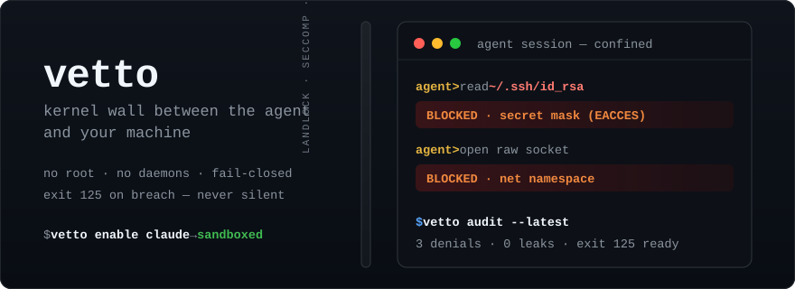
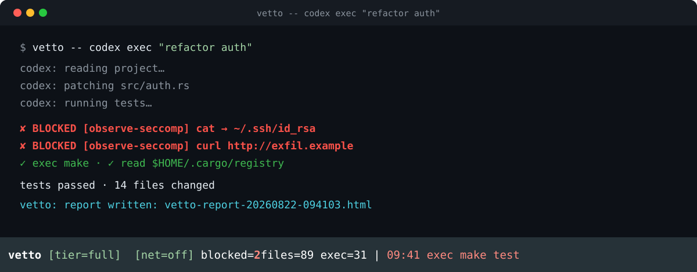
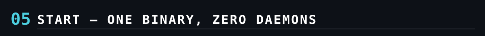

<p align="center">
  
</p>

<p align="center">
  <a href="https://github.com/shleder/vetto/blob/main/LICENSE"></a>
  
  
  
  
  
</p>

**vetto** wraps any locally-invoked AI coding agent — `codex`, `claude`,
custom scripts, unsandboxed tools — in an OS-level sandbox, shows what the
agent is doing in a terminal-native UI, and produces post-session audit
reports. One binary. Zero daemons. Kernel-enforced. Instant visibility.

```console
$ vetto -- codex exec "refactor auth module"
$ vetto -- claude -p "fix the bug"
$ vetto --net=allowlist:registry.npmjs.org -- npm install
$ vetto --tui=full --observe-seccomp --report html,md -- make test
$ vetto doctor --probe
```

<p align="center">
  
</p>

Modern agents ship their own sandboxing (Codex CLI uses Landlock+seccomp on
Linux / Seatbelt on macOS; Claude Code has bash sandboxing). vetto is not a
replacement — it is the **uniform layer above heterogeneous built-ins**:

| Competitor / alternative | Overlap | vetto's edge |
|---|---|---|
| AgentJail | HIGH | daemon-less, zero config (no OPA/Rego daemon) |
| Watchfire | HIGH | single binary, no `watchfired` |
| ZeroClaw | MEDIUM | terminal-native, no web dashboard |
| landrun | MEDIUM | agent awareness + TUI + audit + macOS |
| **Agent built-in sandboxes** (Codex, Claude Code) | HIGH | one consistent policy + audit layer across ANY agent — custom, older, or unsandboxed; unified cross-agent reports; defense-in-depth you control |

One policy file, one statusline, one report format — for every agent on your
machine, regardless of what the agent itself does (or doesn't) enforce.

**Anti-features — deliberately NOT built:**

- ❌ no persistent daemon of any kind
- ❌ no OPA / Rego / policy-as-code engine — policy is one simple TOML file
- ❌ no web dashboard / Electron GUI / fleet mission-control
- ❌ no cloud, no telemetry, no phone-home
- ❌ no root requirement — fully unprivileged
- ❌ no Docker/VM dependency — kernel primitives only
- ❌ no SNI inspection / TLS MITM / CA injection — ever

<p align="center">
  
</p>

Linux is the primary platform. **Do not assume “works everywhere
unprivileged” — it depends on your kernel:**

| | Tier FULL (default) | Tier FS-ONLY (automatic fallback) |
|---|---|---|
| Requirements | Landlock (kernel ≥ 5.13) + unprivileged user namespaces | Landlock (kernel ≥ 5.13) + seccomp filters |
| Filesystem | Landlock + mount-namespace overlays masking secrets | Landlock only; project tree enumerated at load time |
| Namespaces | USER+MOUNT+PID+NET+IPC; killing vetto kills everything | none; `setpgid`+`PDEATHSIG` cleanup |
| Network off | interface-less netns | seccomp-BPF `socket(AF_INET*)` → `EAFNOSUPPORT` |
| Network allowlist | ✅ unix-fd bridge relay | ❌ (fails closed with a clear error) |
| Orphan guarantee | PID namespace: kernel kills the whole ns | honest gap: grandchildren that `setsid()` away survive |
| Typical blockers | Ubuntu 23.10+ AppArmor userns restrictions, some enterprise distros | (almost everywhere Landlock works) |

macOS: Seatbelt via `sandbox-exec` — deprecated and undocumented by Apple;
works today, platform risk accepted (see [SECURITY.md](SECURITY.md)).

Windows: absent from v0.1; on the v0.3+ roadmap. A Windows build attempt
fails with an explicit error instead of producing a broken binary.

`vetto doctor` reports exactly which tier you get and why; `vetto doctor
--probe` actively verifies every denied path is unreachable from inside a
throwaway sandbox. Filesystem decisions happen in the kernel on the resolved
inode — symlink/TOCTOU escape tricks are structurally impossible on Linux.

<p align="center">
  
</p>

- **`--net=off` (default)** — no sockets, no DNS, no exfiltration, on every
  tier: an interface-less network namespace on FULL, a seccomp socket block
  on FS-ONLY.
- **`--net=allowlist:d1,d2`** — CONNECT-level domain allowlist: the domain is
  read from the proxy CONNECT target *before* TLS; DNS is resolved
  broker-side (the child's `resolv.conf` is a blackhole); non-proxy
  protocols fail closed (git-over-SSH won't work — documented). No TLS
  decryption, no CA injection, no SNI parsing — ever.

<p align="center">
  
</p>

<p align="center">
  
</p>

- **`--tui=statusline` (default)** — the agent keeps its own interactive TUI
  on a PTY sized `rows−1`; vetto draws one reserved row: tier badge, net
  mode, blocked/files counters, last event. `Ctrl+]` opens a scrollable
  event overlay; resizes propagate.
- **`--tui=full`** — vetto owns an alternate-screen dashboard; the agent runs
  headless with captured output in a pane. For batch/CI/observability runs
  (`--ci` prints a JSON summary).
- **Honest observation** — allowed ops come from a best-effort `/proc` poller
  (~100 ms granularity); blocked attempts are only visible with an
  observation channel (kernel audit — rarely readable unprivileged — or
  `--observe-seccomp`, which never enforces). Without either, vetto shows a
  persistent notice: **enforcement is ACTIVE regardless**.
- **Post-session audit** — JSONL event log, self-contained HTML/MD/JSON
  reports, and a secret sanitizer labeled **BEST-EFFORT** everywhere it
  appears (it can produce false positives and misses).

<p align="center">
  
</p>

```console
$ cargo install --git https://github.com/shleder/vetto
$ vetto doctor                # what does this machine support?
$ cd my-project
$ vetto -- codex exec "..."   # or claude, aider, python agent.py, make test...
```

Statusline keys: `Ctrl+]` opens the event overlay, `Esc`/`q` closes it.
Dashboard keys: `q` quits (kills the agent), arrows/PgUp/PgDn scroll.

**Profiles** — `default` (project+tmp write, caches read-only), `strict`
(minimal), `audit` (same fs; pair with `--observe-seccomp --jsonl --report`),
`permissive` (wide toolchain read; secrets still denied). `vetto profiles`
lists them, `vetto init` writes a starter `vetto.toml`, run it with
`--policy vetto.toml`.

---

**Honesty first:** every limitation is written down, not hidden — see
[SECURITY.md](SECURITY.md) (the full list), [ARCHITECTURE.md](ARCHITECTURE.md)
(the fork chains, network topology, visibility model),
[docs/threat-model.md](docs/threat-model.md) and
[docs/performance.md](docs/performance.md). Fail-closed is non-negotiable: if
the sandbox cannot be established, the agent does not run — there is never an
unsandboxed fallback.

License: Apache-2.0.
