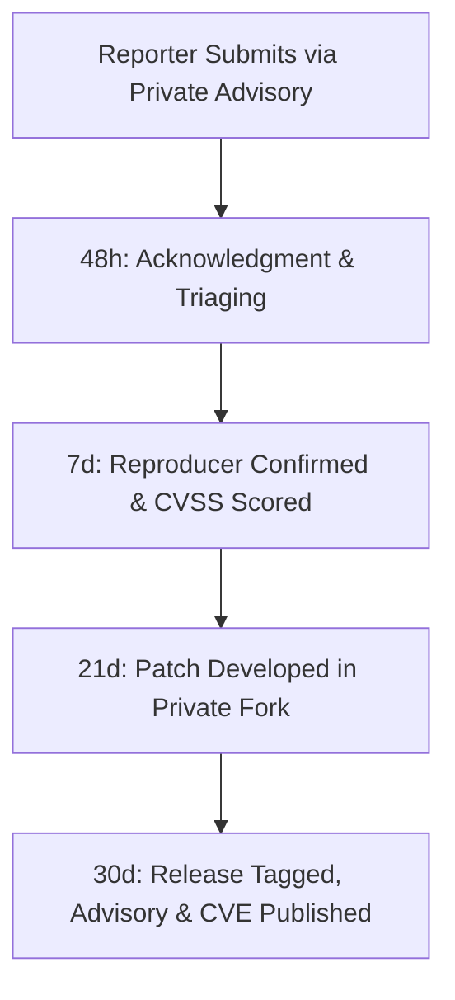

# Vulnerability Management and CVE Process

This document defines the vulnerability disclosure and incident response lifecycle for the `vetto` security layer.

---

## 1. Response Service Level Agreement (SLA)

| Phase | Target SLA | Actions Taken |
|---|---|---|
| **Acknowledgment** | **Within 48 hours** | Confirm report receipt and establish secure communication channel with reporter. |
| **Triage & Assessment** | **Within 7 days** | Validate reproducer in isolated environment, evaluate attack vector, assign preliminary CVSS v3.1 / v4.0 score. |
| **Remediation & Patching** | **Within 21 days** | Develop candidate fix, create regression integration test, prepare release artifacts. |
| **Coordinated Release & CVE** | **Within 30 days** | Publish patch release, emit GitHub Security Advisory, submit CVE record to CNA. |

---

## 2. Severity Classification Guidelines

Because `vetto` is a security sandbox, severity is scored according to the impact on the security boundary:

### Critical (CVSS 9.0–10.0)
- Full sandbox breakout resulting in arbitrary code execution outside kernel namespaces or Seatbelt restrictions.
- Unmediated network access bypass when `--net=off` is active.

### High (CVSS 7.0–8.9)
- Arbitrary file write outside designated write roots.
- Bypassing secret file masking to exfiltrate private credentials (`.env`, `~/.ssh/id_rsa`, `~/.aws/credentials`).

### Medium (CVSS 4.0–6.9)
- Denial of service against the host system (e.g. resource ceiling bypass).
- Cross-process tampering between sandboxed agent processes when isolated.

### Low / Informational (CVSS 0.1–3.9)
- Missing observation event in TUI or JSONL feed (as enforcement is decoupled from observation).
- Best-effort secret scrubber misses in post-session audit logs.

---

## 3. Coordinated Vulnerability Disclosure Lifecycle

1. **Submission**: Reports must be submitted via [GitHub Security Advisories](https://github.com/shleder/vetto/security/advisories/new).
2. **Private Development**: Fixes are developed in private branch forks and validated against integration test batteries.
3. **Release & Notification**: Security patches are released with clear release notes, CVE identifiers, and reporter acknowledgments.
